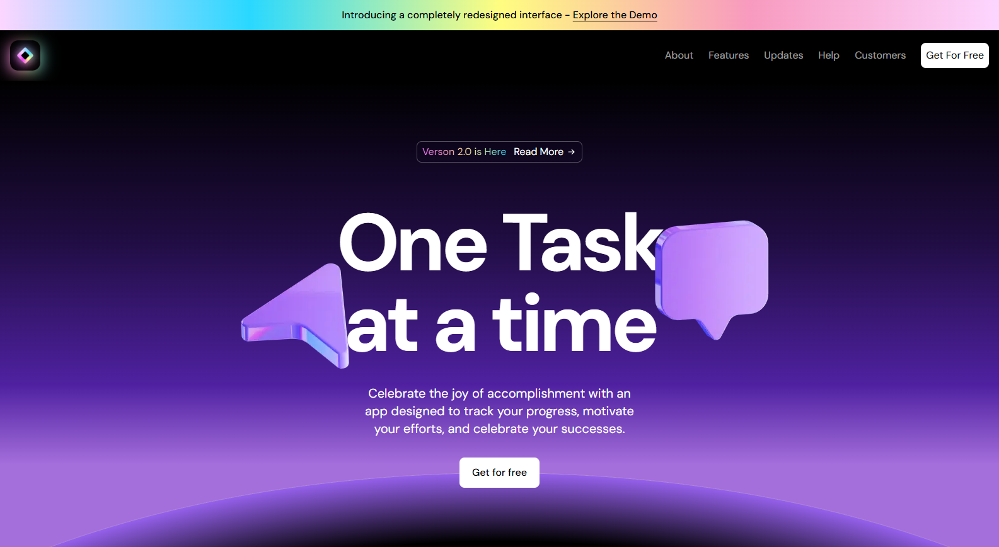

# Eclipse Platform - Modern SaaS Landing Page Template

A sophisticated, dark-themed SaaS landing page template developed by [Jeffrey Hasan](https://github.com/jeffreyhasan10). Eclipse Platform provides developers with a premium foundation for building impressive SaaS product landing pages with minimal setup time.



## Features

- 🌑 Premium dark interface with cosmic-inspired aesthetics
- 🚀 Built with Next.js and TypeScript for stellar performance and type safety
- 💅 Fully responsive design that adapts seamlessly across all devices
- 🎨 Orbital animations and interactive elements for an immersive user experience
- 📱 Mobile-first approach with strategically optimized viewports
- 🔍 SEO-optimized structure for maximum visibility

## UI Components

- Celestial hero section with orbital gradient animations
- Feature showcase with eclipse hover effects
- Tiered pricing constellation
- Stellar testimonials section
- Expandable FAQs system
- Orbital contact form
- Comprehensive footer with social constellation links

## Tech Stack

- [Next.js](https://nextjs.org/)
- [TypeScript](https://www.typescriptlang.org/)
- [Tailwind CSS](https://tailwindcss.com/)
- [Framer Motion](https://www.framer.com/motion/) for celestial animations

## Getting Started

1. Clone the repository:

```bash
git clone https://github.com/jeffreyhasan10/eclipse-platform
cd eclipse-platform
```

2. Install dependencies:

```bash
npm install
# or yarn install
# or pnpm install
# or bun install
```

3. Launch the development server:

```bash
npm run dev
# or yarn dev
# or pnpm dev
# or bun dev
```

4. Open [http://localhost:3000](http://localhost:3000) in your browser to witness the Eclipse.

## Customization

Eclipse Platform is designed for easy customization. Begin by modifying files in the `app` directory. The template features a modular architecture, making it simple to add, remove, or transform sections.

Key files to edit:
- `app/page.tsx` - Main orbital landing page
- `components/` - Celestial UI components
- `styles/` - Global styles and eclipse theme configuration

## Credits

This project includes elements adapted from "SaaS Website UI Kit" by Framer. Retrieved from [Source Link](https://www.figma.com/community/file/1347551304372055519) (licensed under CC BY 4.0).

## About the Creator

Eclipse Platform was developed by [Jeffrey Hasan](https://github.com/jeffreyhasan10), a frontend developer with a passion for crafting stunning user interfaces.

- [GitHub](https://github.com/jeffreyhasan10)
- [Medium](https://medium.com/@jefyjery10)
- [LinkedIn](https://www.linkedin.com/in/jeffreyhasan/)

Explore my other projects and articles for more innovative frontend development content!

## Deploy on Vercel

The fastest way to launch your Eclipse Platform is through the [Vercel Platform](https://vercel.com/new) from the creators of Next.js.

Check out the [Next.js deployment documentation](https://nextjs.org/docs/deployment) for more celestial details.

## License

Eclipse Platform is licensed under the MIT License - see the LICENSE file for details.